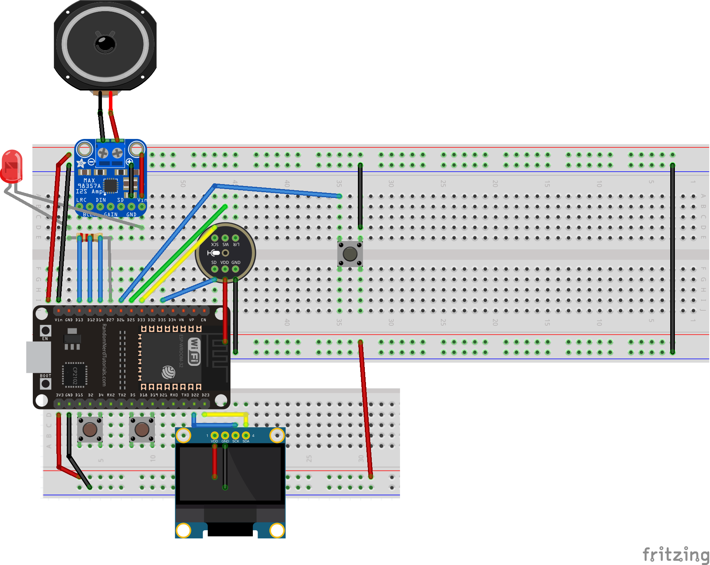
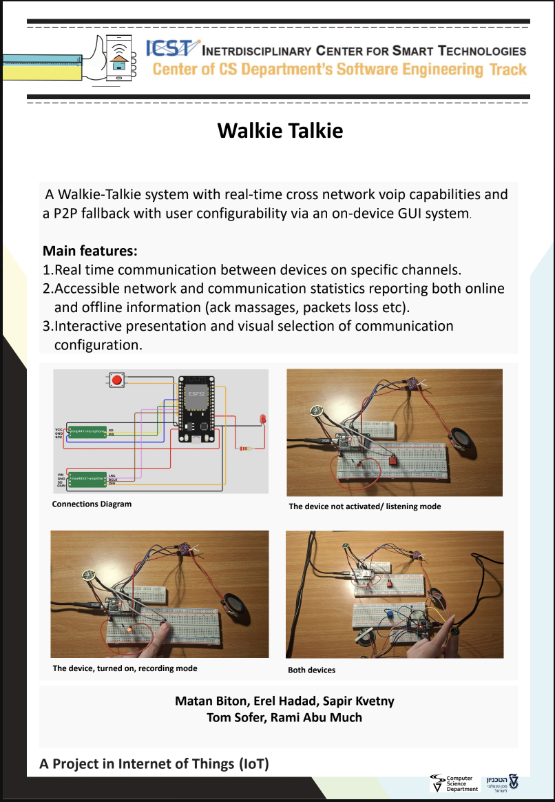

# Walkie-Talkie Project — Group 14
Group members: Erel Hadad, Sapir Kvetny, Matan Biton  

Advisors: Rami Abu Much
## Details about the project

A half-duplex ESP32 walkie-talkie with channel selection through an OLED interface. Audio is transmitted through Firebase Realtime Database in **VoIP mode** and can fall back to **ESP-NOW P2P mode** after repeated upload failures. The system also provides user-availability checks, adjustable audio settings, communication-status feedback, and a companion Flutter application.

Before flashing each ESP32, configure its unique `DEVICE_ID` and `USER_ID`, Wi-Fi settings, and Firebase RTDB URL in `ESP32/app_config.h`.

## Folder description

* `ESP32/`: ESP32 firmware source code.
* `Documentation/`: wiring diagram, Fritzing connection diagram file and basic operating instructions.
* `Unit Tests/`: tests for individual input and output hardware components.
* `Parameters/`: descriptions of configurable firmware parameters and settings.
* `assets/`: project poster.

## ESP32 SDK version used in this project

* **ESP32 Arduino Core by Espressif Systems:** `TODO: add installed version`

## Arduino/ESP32 libraries used in this project

* **FirebaseClient by Mobizt** — version **2.2.13** or a compatible 2.2.x release.
* **ESP_SSLClient** — `TODO: add installed version`.
* **Adafruit GFX Library** — `TODO: add installed version`.
* **Adafruit SSD1306** — `TODO: add installed version`.
* **WiFi, Wire, ESP-NOW, I2S, FreeRTOS and mbedTLS** — included with the ESP32 Arduino Core.

## Connection diagram

| Component       | ESP32 connection                             |
| --------------- | -------------------------------------------- |
| I2S speaker     | LRC/WS: GPIO 12, BCLK: GPIO 14, DIN: GPIO 27 |
| I2S microphone  | SD: GPIO 34, SCK/BCLK: GPIO 32, WS: GPIO 33  |
| Main PTT button | GPIO 25 to physical GND                      |
| Left button     | Input: GPIO 4, virtual GND: GPIO 15          |
| Right button    | Input: GPIO 19, virtual GND: GPIO 5          |
| SSD1306 OLED    | SCL: GPIO 22, SDA: GPIO 23                   |
| Status LED      | GPIO 26 through a current-limiting resistor  |

The buttons use `INPUT_PULLUP`, so a pressed button reads `LOW`. GPIO 15 and GPIO 5 are configured as outputs and held `LOW` to act as virtual grounds.

## Project Poster

---

This project is part of [ICST — The Interdisciplinary Center for Smart Technologies](https://icst.cs.technion.ac.il/), Taub Faculty of Computer Science, Technion.
